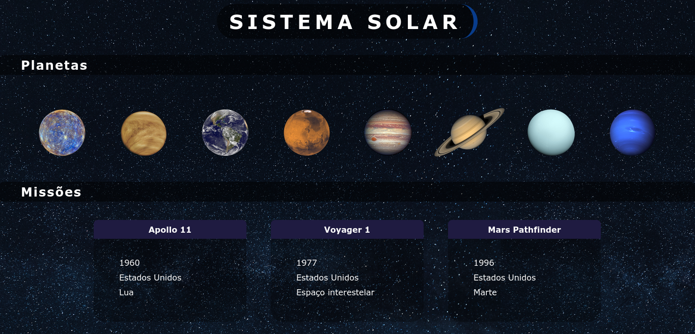

# Boas vindas ao repositório do projeto Sistema Solar!

---

# Sumário

- [Boas vindas ao repositório do projeto Sistema Solar!](#boas-vindas-ao-repositório-do-projeto-sistema-solar)
- [Sumário](#sumário)
- [Habilidades](#habilidades)
- [Entregáveis](#entregáveis)
  - [O que foi desenvolvido](#o-que-foi-desenvolvido)

---

# Habilidades

  * Utilizar JSX no React

  * Utilizar corretamente o método `render()` para renderizar componentes

  * Utilizar `import` para trazer componentes em diferentes arquivos

  * Criar componentes de classe em React

  * Criar múltiplos componentes a partir de um array

  * Fazer uso de `props` corretamente

  * Fazer uso de `PropTypes` para validar as `props de um componente`

---

# Entregáveis

## O que foi desenvolvido

Foi desenvolvido um modelo do sistema solar! Ao utilizar essa aplicação, a pessoa usuária é capaz de:

  * Visualizar todos os planetas do sistema solar renderizados na tela;

  * Visualizar todas as cartas com informações sobre missões espaciais;

---

  
  
  <a href="https://www.npmjs.com/"</a>
  <a href="https://pt-br.reactjs.org/"</a>
</div
